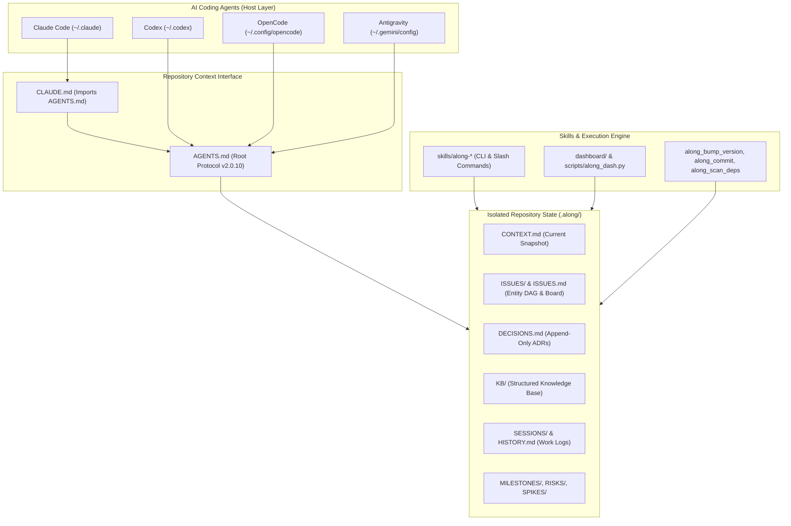

# Along System Architecture & Boundaries

Along (`actdim-along`) is a provider-agnostic agent-context and memory architecture designed to provide durable, persistent context for AI coding agents across **Claude Code**, **Codex**, **OpenCode**, and **Antigravity**.

---

## 1. Architectural Layers & Boundaries

---

## 2. Core Components

1. **Protocol Engine (`ALONG-PROTOCOL`)**:
   - Standardized format stamped in `AGENTS.md` and referenced in subdirectories.
   - Enforces structured YAML frontmatter (`protocol: along`), strict ASCII typography, zero-friction intent recognition, and entity lifecycle.

2. **Isolated Repository Memory (`.along/`)**:
   - `CONTEXT.md`: Short, high-signal "you are here" snapshot (< 20 lines).
   - `ISSUES.md` & `ISSUES/<type>--<slug>.md`: Entity board and individual issue tracking with typed dependencies (`blocked_by`, `related`, `parent`).
   - `DECISIONS.md`: Single-file append-only Architecture Decision Record (ADR) log.
   - `KB/`: Structured topic articles cross-linked via `[[wiki]]` syntax.
   - `SESSIONS/<year>/<date>--<slug>.md` & `HISTORY.md`: Append-only session journal.

3. **Skills & Automation Suite (`skills/along-*`)**:
   - `along-init`: Scaffolds and refreshes repository context idempotently.
   - `along-bump-version`: Universal multi-stack version bumping and release pipeline.
   - `along-commit`: Conventional committer with typography sanitizer and quality gates.
   - `along-scan-deps`: Discovers library AI context (`AGENTS.md`, `llms.txt`, manifest metadata).
   - `along-dash`: Executive dashboard with FastAPI backend, CLI summary, and Cytoscape DAG visualization.
   - `along-wrap`: Comprehensive end-of-stage verification and state reconciliation.

4. **Dashboard & API Service (`dashboard/` & `packages/dashboard-ui/`)**:
   - Modular FastAPI service providing REST endpoints and Server-Sent Events (SSE).
   - Reactive Web UI built with `@actdim/dynstruct`, `@actdim/dynstruct-mui`, and `@actdim/msgmesh`.

---

## 3. Data Flows

1. **Session Start**: Agent reads `AGENTS.md`, `.along/CONTEXT.md`, `.along/ISSUES.md`, and `.along/DECISIONS.md`.
2. **Execution & Incremental Changes**:
   - Agent auto-infers tasks, risks, or spikes and tracks them in `.along/ISSUES/`.
   - Modifies codebase following project rules.
3. **Session / Stage Wrap-up**:
   - Verification tests run via quality gates.
   - Finished issues moved to `.along/ISSUES/done/`.
   - Session log generated in `.along/SESSIONS/`.
   - `.along/CONTEXT.md`, `.along/ISSUES.md`, and `.along/HISTORY.md` synchronized.
