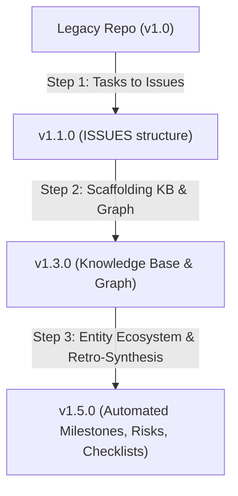

# Protocol & Repository Migrations Guide

This guide documents the versioned migration pipeline for the `ACTDIM-AGENTS-PROTOCOL` (`.agents/`).

---

## 🎯 Overview

When updating `actdim-agents` or running `/init-agents`, the migration engine (`scripts/migrate_protocol.py`) inspects the target repository's current `.agents/` structure and protocol version, executing sequential, non-destructive migration steps to bring it up to the latest standard without losing any human-written content.

---

## 🔄 Version Migration Pipeline



### 1. `v1.0.0` $\rightarrow$ `v1.1.0` (Tasks to Issues)
- **Problem**: Earlier versions used `TASKS.md` and `.agents/TASKS/`.
- **Migration Action**:
  - Renames `TASKS.md` $\rightarrow$ `ISSUES.md` and replaces `TASKS` glyphs.
  - Renames `TASKS/` $\rightarrow$ `ISSUES/`.
  - Enforces kebab-case `<type>--<slug>.md` naming for all issue files.

### 2. `v1.1.0` $\rightarrow$ `v1.3.0` (Knowledge Base & Code Graph)
- **Problem**: Projects lacked structured architecture and domain model documentation.
- **Migration Action**:
  - Scaffolds `.agents/KB/` (`INDEX.md`, `01-architecture.md`, `02-domain-model.md`, `03-setup-and-workflow.md`).
  - Creates `.code-review-graph-ignore` with standard excludes (`node_modules/`, `dist/`, `build/`, `SESSIONS/`).

### 3. `v1.3.3` $\rightarrow$ `v1.5.0` (Automated Entity Ecosystem & Retro-Synthesis)
- **Problem**: Missing unified tracking entities (`MILESTONES`, `RISKS`, `SPIKES`, `CHECKLISTS`) and structured metadata (`completed: YYYY-MM-DD`, `milestone: <slug>`) needed for visual dashboards.
- **Migration Action**:
  - **Directory Scaffolding**: Creates `.agents/MILESTONES/`, `.agents/RISKS/`, `.agents/SPIKES/`, `.agents/CHECKLISTS/`, `.agents/KB/`, and `.agents/ISSUES/done/`.
  - **Retroactive Milestone Synthesis**:
    - Analyzes past `SESSIONS/`, `HISTORY.md`, and `ISSUES/done/` to synthesize completed milestone(s) (e.g. `v1.3.0-knowledge-base-and-graph.md`) with `status: completed`, `progress_pct: 100`.
    - Synthesizes an active milestone for open issues (e.g. `v1.5.0-dashboard-and-analytics.md`) with `status: in-progress`.
  - **Checklists Synthesis**: Scaffolds reusable QA quality gates in `.agents/CHECKLISTS/` (`stage-completion.md`, `pre-commit.md`).
  - **Front-Matter Enrichment**:
    - Sets `completed: YYYY-MM-DD` for all closed issues.
    - Links every issue to its corresponding `milestone: <slug>`.
  - **Typography Sanitation (Banning Em-Dashes)**:
    - Automatically scans all `.md` files in `.agents/` and replaces non-standard em-dashes (`-`) with standard ASCII hyphens (`-`).
    - Automatically scans all `.md` files in `.agents/` and replaces non-standard em-dashes (U+2014) with standard ASCII hyphens (`-`).
    - Standardizes quotes and clean UTF-8 encoding across all documentation.

---

## 🛠️ How Migrations are Executed

### 1. Automatic Execution (Zero-Friction)
- **During Installation**: Running `install.ps1` (or `install.sh`) automatically runs `migrate_protocol.py` on the current repository.
- **During Project Initialization / Refresh**: Invoking `/init-agents` runs the migration engine against the target folder automatically.

### 2. Manual CLI Invocation
To migrate any repository explicitly:
```bash
# Windows / Linux / macOS
python scripts/migrate_protocol.py /path/to/target/repo
```

