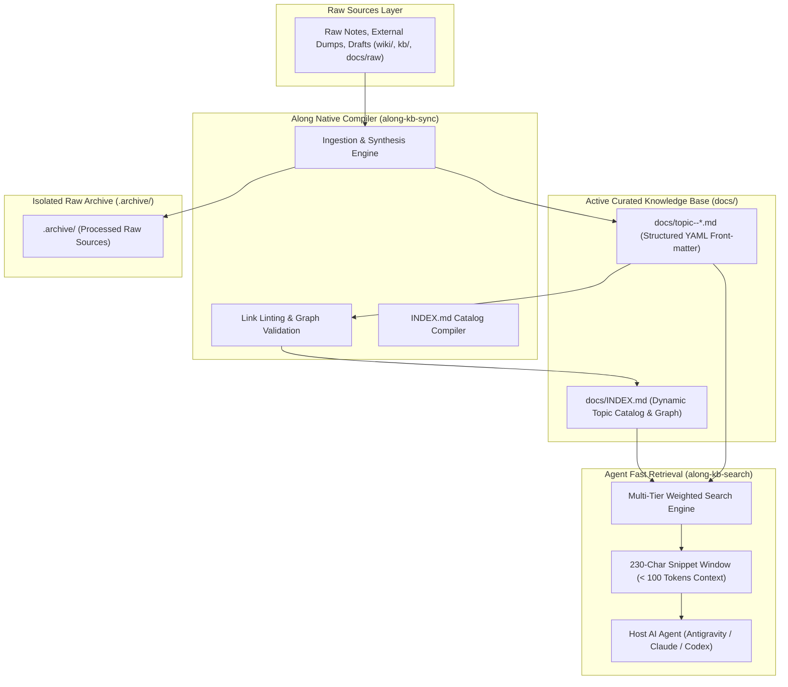

# LLM-Wiki Knowledge Base Architecture & Paradigm

Along implements the **LLM-Wiki architectural paradigm** (originated by Andrej Karpathy) as a native, provider-agnostic knowledge management system for software repositories.

---

## 1. Why LLM-Wiki? (The Core Problem)

AI coding agents face two common failure modes when navigating repository documentation:

1. **Context Bloat & Prompt Saturation (Prompt Stuffing)**:
   - Reading whole multi-kilobyte documentation files into agent prompts consumes 10,000 to 30,000+ tokens per interaction.
   - This exhausts the context window, degrades model reasoning, and drives up inference costs.
2. **Opaque & Fragile External Vector DBs**:
   - Heavy external vector databases introduce opaque embeddings, complex C-extension dependencies, and lack human-editable Markdown transparency.

### The Solution: The Living LLM-Wiki
A structured, human-readable directory of interconnected Markdown files (`docs/topic--*.md`) with YAML front-matter, an auto-compiled catalog (`docs/INDEX.md`), isolated raw source archives (`.archive/`), and an ultra-fast, local snippet search engine (`along-kb-search`).

---

## 2. LLM-Wiki Architecture & Data Flow

---

## 3. Fast Retrieval Mechanics & Multi-Tier Scoring

Instead of loading whole articles, AI agents query `along-kb-search "<query>"` to retrieve concise context snippets in milliseconds.

### Multi-Tier Weighted Scoring Algorithm
The search engine ranks results using a 3-tier relevance model:

| Match Scope | Weight | Rationale |
| :--- | :--- | :--- |
| **Title Match** | **+10 points** | Direct topic match indicating the exact domain article. |
| **Tags Match** | **+5 points** | Curated metadata keywords matching the conceptual domain. |
| **Body Content** | **+1 point** | Text occurrences within the Markdown body. |

### Snippet Window Extraction (95-98% Token Reduction)
When a match is identified, `along-kb-search` extracts a targeted **230-character snippet window** centered around the matching query term.
- *Prompt Impact*: Delivers the precise architectural constraint or API contract in **under 100 tokens**, compared to 3,000-8,000 tokens for loading the full file.
- *Performance*: Sub-millisecond execution using pure Python standard library without vector embeddings latency.

---

## 4. Separation of Curated Knowledge (`docs/`) vs Raw Sources (`.archive/`)

Along enforces strict segregation between verified active documentation and unmanaged raw source dumps:

1. **Curated Knowledge (`docs/topic--*.md`)**:
   - Every file must carry valid YAML front-matter with `protocol: along`.
   - Written in clean Markdown with universal relative links (`[Title](./topic--<name>.md)`).
2. **Raw Sources Archival (`.archive/`)**:
   - When raw documentation or chat dumps are ingested via `along-kb-sync`, the compiler synthesizes topic articles in `docs/` and moves the original source files to `.archive/`.
   - `.archive/` is strictly excluded from `along-kb-search` and dashboard indexing, preventing noisy duplicate search hits.

---

## 5. Documentation Blast Radius & Code-Graph-to-Wiki Synchronization

In the LLM-Wiki paradigm, documentation is a living asset that evolves alongside code. Along enforces a **Deterministic 2-Phase Blast Radius Gate**:

```mermaid
flowchart LR
    DIFF["Code Modifications (git diff)"] --> CRG["code-review-graph (get_impact_radius_tool)"]
    CRG --> IMPACT["Impacted Symbols & Downstream Callers"]
    IMPACT --> SEARCH["along-kb-search (Topic Query)"]
    SEARCH --> TOPICS["Targeted docs/topic--*.md Files"]
    TOPICS --> EDIT["Factual Article Updates"]
    EDIT --> KBSYNC["along-kb-sync --strict (Integrity Gate)"]
    KBSYNC --> INDEX["docs/INDEX.md & Verified Links"]
```

1. **AST Blast Radius Discovery**: During task review, agents invoke `code-review-graph` MCP tools (`get_impact_radius_tool`, `get_affected_flows_tool`) to identify modified symbols and dependent modules.
2. **Topic Mapping**: Agents query `along-kb-search` with the modified symbol names to pinpoint the exact `docs/topic--*.md` files documenting those interfaces.
3. **Factual Updating**: Agents update the affected topic articles with concrete code facts (zero placeholders).
4. **Compilation & Link Gate**: Running `python scripts/along_kb_sync.py --strict` validates relative links across the repository and recompiles `docs/INDEX.md`.

---

## 6. References & Useful Links

- **Andrej Karpathy's LLM-Wiki Concept**: Conceptual foundation for repository-native, human-readable structured LLM documentation.
- **[System Architecture & Flow](./topic--architecture.md)**: System topology, multi-branch concurrency, and multi-agent state machine.
- **[Domain Model & Entity Ecosystem](./topic--domain-model.md)**: Taxonomy of issues, milestones, ADRs, and living memory.
- **[Skills & Slash Commands Reference](./topic--skills-reference.md)**: Technical breakdown of all 18 automation skills.
- **[Setup & Developer Workflow](./topic--setup-and-workflow.md)**: Installation, runner hooks, and day-in-the-life development flow.
