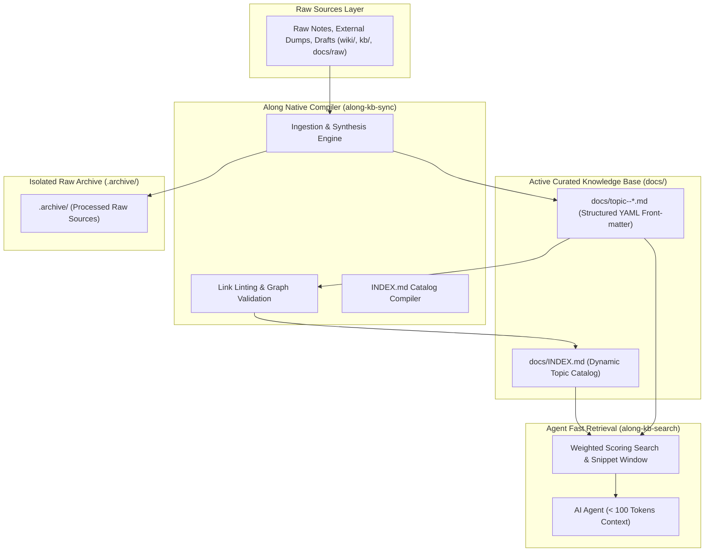

# LLM-Wiki Knowledge Base Architecture & Paradigm

Along implements the **LLM-Wiki architectural paradigm** (originated by Andrej Karpathy) as a native, provider-agnostic knowledge management system for software repositories.

---

## 1. Why LLM-Wiki? (The Core Problem)

AI coding agents face two common failure modes when dealing with repository documentation:

1. **Context Bloat & Token Waste (Prompt Stuffing)**:
   - Reading whole documentation files into the agent prompt consumes 10,000 to 30,000+ tokens per interaction.
   - This exhausts the context window, degrades model reasoning, and drives up inference costs.
2. **Opaque & Unverifiable External Vector DBs**:
   - Heavy vector databases introduce complex external infrastructure, opaque retrieval chunks, and lack human-editable Markdown transparency.

**The Solution: The Living LLM-Wiki**:
A structured, human-readable directory of interconnected Markdown files (`docs/topic--*.md`) with YAML front-matter, an auto-compiled catalog (`docs/INDEX.md`), isolated raw source archives (`.archive/`), and a fast, local snippet search engine (`along-kb-search`).

---

## 2. Architectural Pillars of the Along LLM-Wiki

---

## 3. Key Capabilities & Features

### 1. Separation of Curated Knowledge (`docs/`) vs Raw Sources (`.archive/`)
- Active, verified articles live exclusively in `docs/topic--*.md`.
- Original unstructured notes, chat dumps, and scratch files are moved to `.archive/` upon ingestion.
- The `.archive/` directory is strictly excluded from search and dashboard metrics, preventing duplicate hits and noise.

### 2. Front-Matter Discrimination (`protocol: along`)
- Files containing `protocol: along` in their front-matter are recognized as active, compiled Wiki articles and remain untouched during re-synchronization.
- Files lacking `protocol: along` are treated as raw sources, compiled into topic articles, and archived.

### 3. Token-Efficient Snippet Retrieval (95-98% Reduction)
- Instead of reading multi-kilobyte documents, agents invoke `along-kb-search "<query>"`.
- The search engine calculates weighted relevance (Title: +10, Tags: +5, Body: +1) and extracts a targeted 230-character snippet window.
- The agent obtains the precise fact needed in under 100 tokens.

### 4. Deterministic Link Linting & Graph Invariance
- All cross-references use standard relative Markdown links (`[System Architecture & Flow](./topic--architecture.md)`).
- The `along-kb-sync` compiler scans every link and detects broken or dangling references before commits are made.

### 5. Adaptive Ingestion & Parallel Research
- **Small Updates**: Main agent synthesizes articles directly.
- **Large-Scale Dumps**: Agent autonomously splits the topic into distinct domain vectors, spawns parallel research subagents, and lets `along-kb-sync` reconcile and link the generated articles.

### 6. Zero External Dependencies
- Implemented in 100% pure Python standard library (`os`, `re`, `argparse`, `sys`).
- No Node.js, `npm`, or third-party binary requirements.
- Runs identically across Claude Code, OpenAI Codex, OpenCode, and Google Antigravity.
