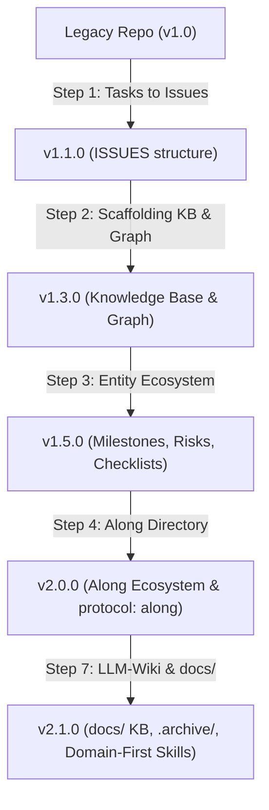

# Protocol & Repository Migrations Guide

This guide documents the versioned migration pipeline for the `ALONG-PROTOCOL` (`.along/`).

---

## 1. Overview & Execution Engine

When running `/along-init`, `/along-update`, or `install.ps1`, the migration engine (`scripts/migrate_protocol.py`) inspects the target repository's current structure and executes sequential, non-destructive migration steps to bring it up to the latest standard.

---

## 2. Version Migration Steps

### `v1.0.0` -> `v1.1.0`: Tasks to Issues
- Renames `TASKS.md` -> `ISSUES.md` and `TASKS/` -> `ISSUES/`.
- Enforces kebab-case `<type>--<slug>.md` naming for all issue files.

### `v1.1.0` -> `v1.3.0`: Knowledge Base & Code Graph
- Scaffolds initial Knowledge Base (`INDEX.md`, `01-architecture.md`, `02-domain-model.md`, `03-setup-and-workflow.md`).
- Creates `.code-review-graph-ignore` with standard excludes (`node_modules/`, `dist/`, `build/`, `SESSIONS/`).

### `v1.3.0` -> `v1.5.0`: Entity Ecosystem & Retro-Synthesis
- Scaffolds `.along/MILESTONES/`, `.along/RISKS/`, `.along/SPIKES/`, `.along/CHECKLISTS/`, and `.along/ISSUES/done/`.
- Retroactively synthesizes completed milestones from Git history and session logs.
- Sanitizes non-ASCII typography (replacing em-dashes with standard ASCII hyphens).

### `v1.5.0` -> `v2.0.0`: Along Rebranding & Isolated `.along/`
- Migrates `.agents/` to `.along/` and updates `protocol: along` YAML front-matter across all entities.
- Validates entity relationships (`blocked_by`, `related`, `parent`) and verifies zero DAG cycles.

### `v2.0.0` -> `v2.1.0`: LLM-Wiki Architecture & Singular Domain-First Skills
- Migrates active Knowledge Base articles from `.along/KB/` to top-level `docs/`.
- Isolates raw, unmanaged source notes into hidden `.archive/` directory.
- Standardizes all 3-part skills to Singular Domain-First format (`along-<entity>-<action>`).
- Enforces mandatory `along-kb-search` agent querying rule to minimize token usage.
