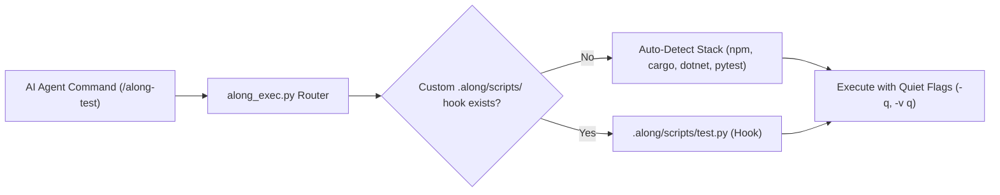
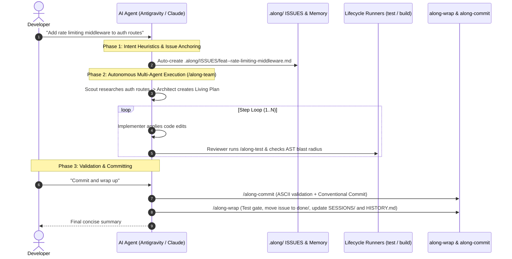

# Setup & Developer Workflow

Complete guide for installing Along, configuring repository lifecycle runners, and executing day-to-day development workflows across host AI agent runtimes.

---

## 1. Installation & Multi-Platform Setup

Along installs globally and configures provider-agnostic agent discoverability across Claude Code, OpenAI Codex, OpenCode, and Google Antigravity.

### Windows Installation
Run PowerShell as Administrator or with standard permissions:
```powershell
# Install for all supported agent runtimes (Claude, Codex, Antigravity, OpenCode)
powershell -NoProfile -ExecutionPolicy Bypass -File install.ps1 -Target all

# Or run the batch installer
install.bat all
```

### Linux / macOS Installation
```bash
# Make installer executable and run
chmod +x install.sh
./install.sh all
```

### Supported Installation Targets
- `-Target all`: Deploys skills to `~/.claude/skills/`, `~/.codex/skills/`, `~/.gemini/config/skills/`, and `~/.config/opencode/commands/`.
- `-Target claude`: Deploys only to Claude Code.
- `-Target codex`: Deploys only to OpenAI Codex.
- `-Target antigravity`: Deploys only to Google Antigravity.
- `-Target opencode`: Deploys only to OpenCode.

---

## 2. Python Runtime & Dependencies

The engines behind the skills need one third-party package, `ruamel.yaml`, to read and
write entity front-matter. Everything else is standard library.

```bash
# Recommended: install the toolchain with uv (creates an isolated environment)
uv tool install actdim-along

# Working inside this repository: uv resolves the environment from pyproject.toml
uv run python -m unittest discover tests -q

# No uv, no install: add the dependency to the active interpreter
python -m pip install "ruamel.yaml>=0.18"
```

An engine invoked directly as `python scripts/along_exec.py ...` or
`python ~/.along/bin/along_exec.py ...` checks for the dependency itself: if it is missing
and `uv` is on `PATH`, the engine re-executes once under `uv run` and continues. If `uv` is
absent it exits with code 2 and the two commands above, rather than a traceback.

Why a dependency at all: front-matter is YAML because tools that are not Along read it, and
a hand-rolled parser silently dropped block sequences and emitted blocks that no strict YAML
reader accepts. See [ADR-2026-09-01--frontmatter-on-ruamel-yaml](../.along/DECISIONS.md).

The dashboard (`/along-dash`) additionally needs FastAPI, Uvicorn, Pydantic, and Rich,
declared as the `dash` extra and resolved automatically by `uv run scripts/along_dash.py`.

---
## 3. Bootstrapping a New or Existing Repository

To initialize Along in any repository:
```bash
# Inside the repository root, run:
along-init
```
*(Or invoke `/along-init` directly inside your AI agent prompt).*

### What `along-init` Configures:
1. `AGENTS.md`: Generates the root protocol context with the managed `ALONG-PROTOCOL v2.2.6` block.
2. `CLAUDE.md`: Scaffolds the standard `@AGENTS.md` import line.
3. `.gitattributes`: Configures `merge=union` for `.along/HISTORY.md` and `.along/DECISIONS.md` to prevent merge collisions across branches.
4. `.along/`: Creates the persistent repository memory skeleton (`ISSUES/`, `DECISIONS.md`, `MILESTONES/`, `RISKS/`, `SPIKES/`, `CHECKLISTS/`, `SESSIONS/`, `docs/`).

---

## 4. Repository Lifecycle Runners (`.along/scripts/`)

Along establishes a unified interface for project lifecycle operations via `.along/scripts/`. This allows AI agents to build, test, run, and bump versions across any technology stack without requiring custom prompt tuning.



### Standard Lifecycle Commands:

| Command | Canonical Script | Fallback Stack Auto-Detection | Purpose |
| :--- | :--- | :--- | :--- |
| `/along-build` | `.along/scripts/build.py` | `npm run build` \| `cargo build` \| `dotnet build` \| `python -m build` | Compiles source artifacts. |
| `/along-test` | `.along/scripts/test.py` | `pytest -q` \| `npm test` \| `cargo test -q` \| `dotnet test -v q` | Executes unit tests with quiet flags. |
| `/along-dev` | `.along/scripts/dev.py` | `npm run dev` \| `cargo run` \| `dotnet run` \| `python main.py` | Starts local development server. |
| `/along-version-bump` | `.along/scripts/bump_version.py` | Node `package.json` \| Python `pyproject.toml` \| Rust `Cargo.toml` \| .NET `*.csproj` | Bumps version and orchestrates release. |

---

## 5. Day-in-the-Life Developer & Agent Workflow

The standard developer workflow in an Along-enabled repository flows through 6 phases:



### Step 1: Morning Sync & Task Triage
- Launch `/along-dash` to inspect sprint KPIs, active blockers in `.along/RISKS/`, and the entity DAG.
- Review active issues in `.along/ISSUES.md`.

### Step 2: Task Claiming & Intent Recognition
- Issue a natural language prompt to the agent (e.g. *"Fix Windows path escaping in CLI"*).
- The agent automatically infers the issue type (`bug`), creates `.along/ISSUES/bug--windows-path-escaping.md`, and sets `status: in-progress`.

### Step 3: Execution via `/along-team`
- For S-size tasks (1-2 files): The agent fast-paths edits directly and runs tests.
- For M/L/XL-size tasks: The agent activates the multi-agent sequential state machine, creating a dynamic Living Plan and verifying each step with an independent Reviewer subagent.

### Step 4: Verification & AST Blast Radius Gate
- Run `/along-test` to ensure zero regressions.
- Execute `/along-graph-check` to trace caller contracts and map affected symbols to `docs/topic--*.md` Knowledge Base articles.

### Step 5: Clean Conventional Commit
- Execute `/along-commit -i <slug> -m "<summary>"`.
- Automatically enforces clean ASCII typography (no em-dashes, no curly quotes) and binds the commit to the active issue.

### Step 6: Session Wrap-Up
- Invoke `/along-wrap` to execute the mandatory completion checklist:
  1. Automated test suite check.
  2. Documentation blast radius sync (`/along-kb-sync`).
  3. Move issue to `.along/ISSUES/done/`.
  4. Reconcile `ISSUES.md` projection.
  5. Record work session log in `.along/SESSIONS/<YYYY>/`.
  6. Append history line to `.along/HISTORY.md`.
  7. Purge ephemeral blackboard `.along/.session/<slug>/`.
